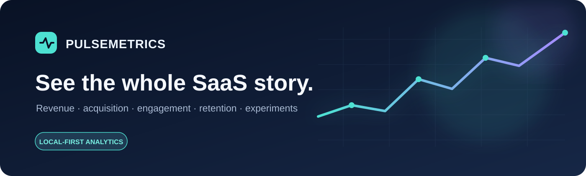
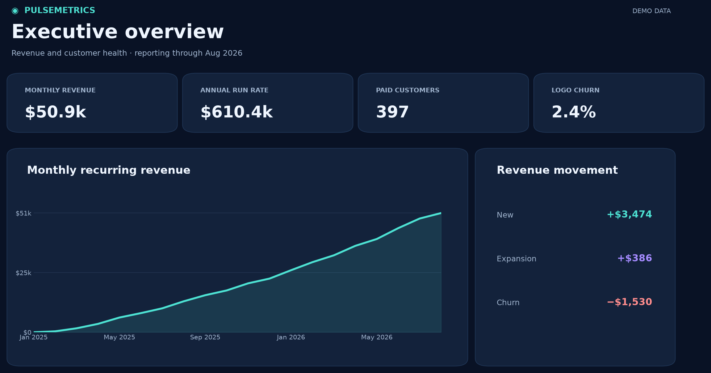
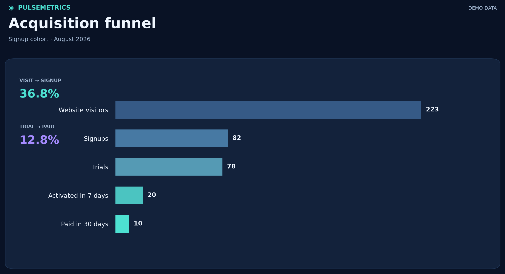
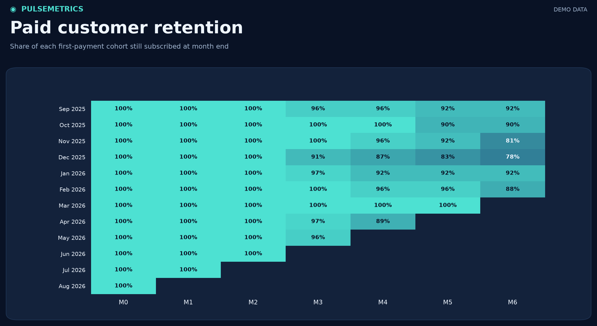
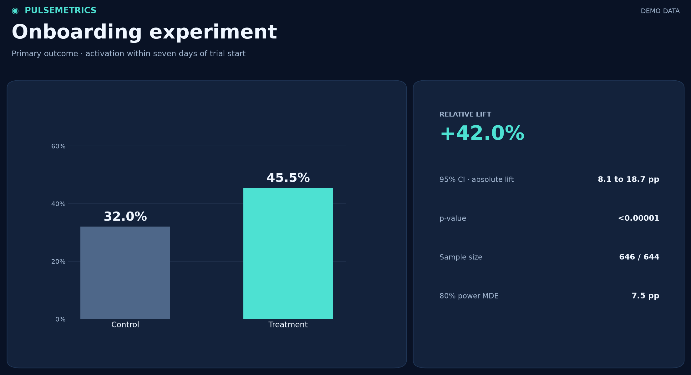
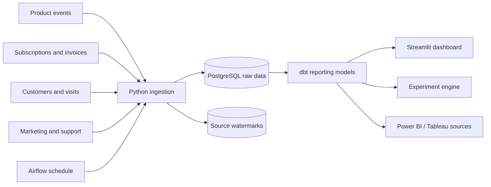

<p align="center">
  
</p>

<p align="center">
  <a href="https://github.com/RajivPraveen/PulseMetrics/actions/workflows/ci.yml"></a>
  
  
  
  
  
</p>

PulseMetrics brings customer activity, subscriptions, invoices, marketing spend, and support history into one analytics workspace. It turns source records into consistent revenue and product metrics, then presents them in an interactive five-page dashboard. A built-in experiment engine answers whether a change to onboarding improves activation.

The repository runs on a laptop with Docker and synthetic data. It includes a daily refresh schedule, data checks, documentation, and a GitHub Actions workflow, so the entire flow can be explored without external accounts.

> [!NOTE]
> The company and data are fictional. The images below were exported from this project's PostgreSQL reporting tables after a demo refresh. They are snapshots; the live dashboard is interactive.

## Explore the product

### Executive overview

Follow monthly and annual recurring revenue, paid customers, churn, customer acquisition cost, lifetime value, and the movements behind revenue growth.



### Acquisition

See where visitors drop between the website, signup, trial, activation, and payment. Compare channel spend, customer acquisition cost, and return on ad spend.



### Retention

Track paid customer cohorts month by month and compare logo churn with revenue churn and net revenue retention.



### Experimentation

Review conversion rates alongside sample size, the confidence interval, p-value, effect size, minimum detectable effect, and power. The recommendation checks whether the result is large enough to matter, not only whether it is statistically significant.



The fifth page, **Engagement**, shows daily, weekly, and monthly active users, stickiness, sessions, and feature adoption. Admin users can access every page; analyst users can access Engagement, Retention, and Experimentation.

## Run it locally

**Requirements:** Docker Desktop or another Docker Compose installation, and available ports `5432` and `8501` on your machine.

```bash
git clone https://github.com/RajivPraveen/PulseMetrics.git
cd PulseMetrics
cp .env.example .env
```

Open `.env` and replace both example dashboard passwords. Then start the database and dashboard, and run the first refresh:

```bash
docker compose up -d postgres dashboard
docker compose --profile jobs run --rm refresh
```

Open **[localhost:8501](http://localhost:8501)**. Sign in with the admin or analyst username and password from `.env`. The first refresh generates synthetic source exports, loads PostgreSQL, builds the reporting tables, runs the quality checks, and calculates the onboarding experiment. Later refreshes reuse the exports and safely skip unchanged source rows.

For daily scheduled refreshes:

```bash
docker compose --profile orchestration up -d airflow
```

Airflow runs the same refresh pipeline at **06:00 UTC** each day. The local profile does not expose an Airflow web interface. See the [operations guide](docs/OPERATIONS.md) for checking runs, handling failures, and configuring webhook alerts.

## How it works



Every source row has a `source_updated_at` timestamp. The loader tracks a separate watermark for each source and updates data and watermark in one transaction. dbt then builds a customer dimension, a customer-month revenue fact, and reporting tables for acquisition, engagement, retention, and executive KPIs. The dashboard reads those reporting tables rather than recalculating metrics in the browser.

The [architecture guide](docs/ARCHITECTURE.md) explains the data flow, storage layers, and extension points in more detail.

## Metrics and decisions

PulseMetrics defines more than 20 measures across revenue, acquisition, engagement, and retention. Examples include:

- **Revenue:** MRR, ARR, new and expansion MRR, contraction, churned MRR, gross revenue churn, and net revenue retention.
- **Acquisition:** visitor-to-signup, trial-to-activation, trial-to-paid, CAC, and channel ROAS.
- **Usage:** DAU, WAU, MAU, DAU/MAU stickiness, sessions, and feature adoption.
- **Customer health:** paid cohort retention, logo churn, average revenue per account, and estimated LTV.

Metric formulas, time windows, and caveats are in the [KPI definitions](docs/KPI_DEFINITIONS.md). Tables and column grains are in the [data dictionary](docs/DATA_DICTIONARY.md).

The onboarding experiment uses a two-sided two-proportion test, a 95% Newcombe interval for the absolute conversion difference, Cohen's h, and power analysis. One demo run produced **32.0% control activation versus 45.5% treatment activation** among 1,290 eligible trial users. These values come from generated data and are an example, not a claim about a real product. See the [experiment guide](docs/EXPERIMENTATION.md) for the population and decision rule.

## Reliability and access

- **Repeatable loads:** upserts and source watermarks let a failed import be retried without duplicating records.
- **Quality checks:** dbt tests keys, relationships, overlapping subscription periods, funnel order, nonnegative KPIs, and MRR reconciliation. Freshness checks watch active sources.
- **Automation:** Airflow retries failed refreshes and can post a failure alert to a configured webhook.
- **Continuous checks:** GitHub Actions runs Python tests, linting, a PostgreSQL-backed dbt build, dbt tests, freshness checks, and the experiment engine.
- **Dashboard access:** admin and analyst roles limit which pages appear. Docker binds the database and dashboard to localhost.

The local credentials and database account are intended for development. Shared deployment requires SSO, HTTPS, a read-only dashboard database account, private networking, and managed secrets. Read [security and access](docs/SECURITY.md) before exposing the stack beyond a local machine.

## Repository map

```text
PulseMetrics/
├── assets/              Brand art and preview charts from demo data
├── bi/                  Power BI measures and Tableau connection notes
├── dags/                Daily Airflow refresh definition
├── dashboard/           Five-page Streamlit application
├── docs/                Architecture, metrics, data, operations, security
├── models/              dbt staging views and reporting models
├── scripts/             Preview image generator
├── sql/                 Raw PostgreSQL schema
├── src/pulsemetrics/     Generator, incremental loader, pipeline, experiments
├── tests/               Python tests and dbt data checks
├── .github/workflows/   Continuous integration
├── docker-compose.yml   Database, dashboard, manual job, scheduler
└── pyproject.toml       Python package and optional dependencies
```

## Develop and verify

For a host Python setup, install Python 3.11+, start PostgreSQL, and run:

```bash
python -m venv .venv
source .venv/bin/activate
pip install -e '.[dashboard,docs,dev]'
python -m pulsemetrics.pipeline
streamlit run dashboard/app.py
```

Useful commands:

```bash
ruff check src tests dashboard dags scripts
pytest -q
dbt run --profiles-dir .
dbt test --profiles-dir .
dbt source freshness --profiles-dir .
python scripts/generate_readme_assets.py
```

The preview generator reads the current PostgreSQL reporting tables and overwrites the images under `assets/previews/`. It requires the optional `docs` dependencies. The CI workflow runs with a disposable PostgreSQL service; Docker-based refreshes use the same model and test code.

## Integration boundaries

The working local warehouse is PostgreSQL, and the working dashboard is Streamlit. The dbt reporting tables are documented as Power BI and Tableau data sources in [BI connectivity](bi/README.md), with starter DAX measures included. Native `.pbix` or Tableau workbook files, S3 ingestion, and Snowflake or BigQuery deployment are not configured in this repository. They can be added when those platforms and credentials are available.

See [CONTRIBUTING.md](CONTRIBUTING.md) for the change and verification workflow.
