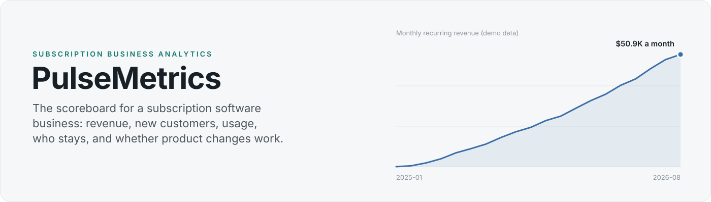
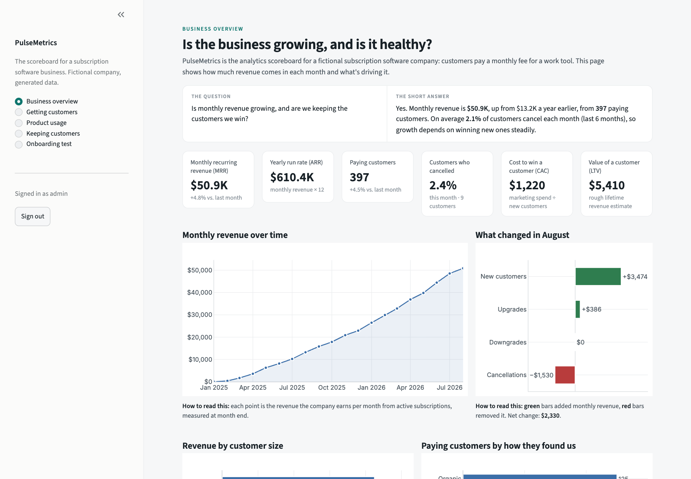
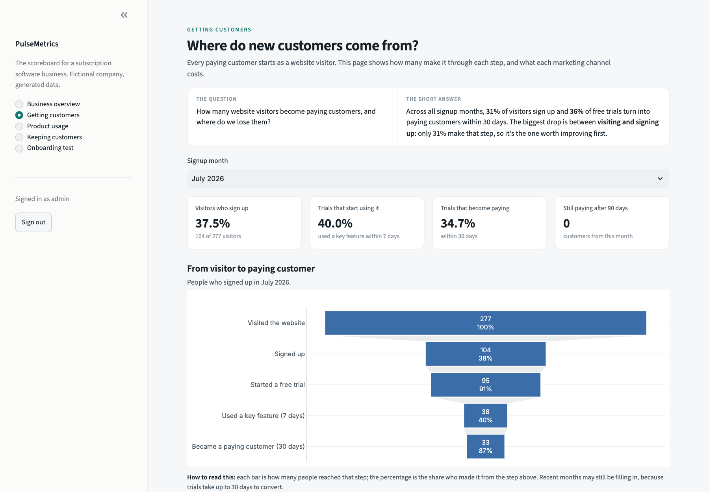
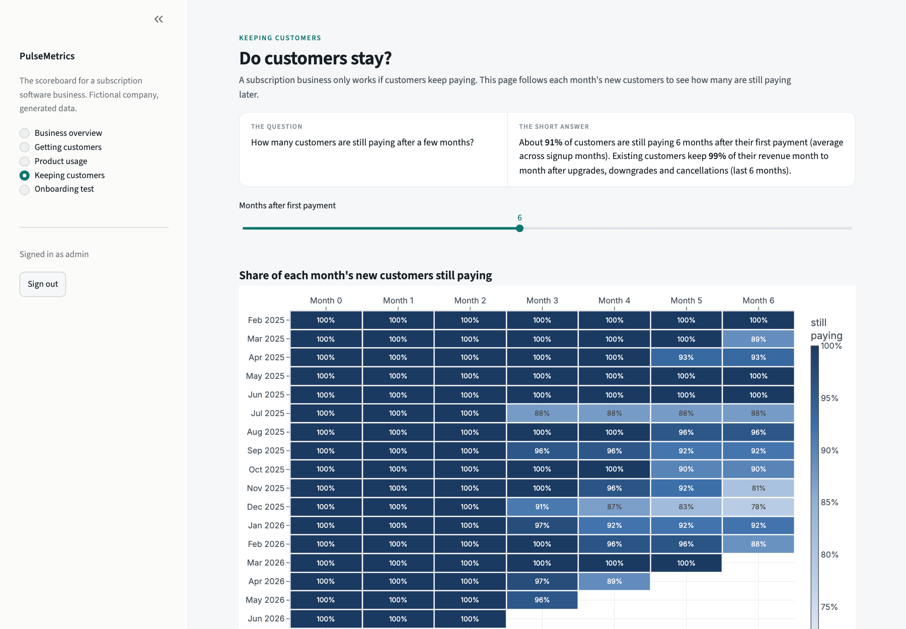
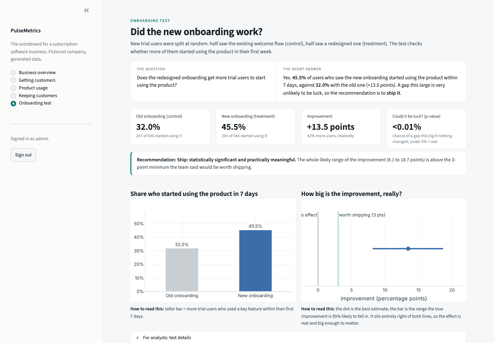
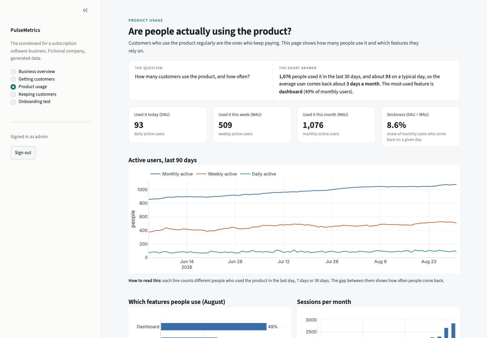
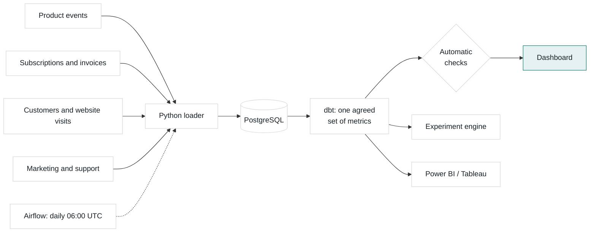

<p align="center">
  
</p>

<p align="center">
  <a href="https://github.com/RajivPraveen/PulseMetrics/actions/workflows/ci.yml"></a>
  
  
  
  
</p>

<p align="center">
  <a href="#what-is-this">What is this?</a> ·
  <a href="#what-it-shows">What it shows</a> ·
  <a href="#the-dashboard">The dashboard</a> ·
  <a href="#kpis-on-the-dashboard">KPIs</a> ·
  <a href="#how-it-works">How it works</a> ·
  <a href="#data-checks">Data checks</a> ·
  <a href="#run-it-locally">Run it</a> ·
  <a href="#for-technical-reviewers">Technical details</a>
</p>

## What is this?

**PulseMetrics is the analytics scoreboard for a subscription software business.**

Picture a company that sells a work tool (dashboards, automation, reporting) for a monthly fee, like Slack or
Notion. Its leadership needs to know, every month:

| The question | Where to look |
|---|---|
| Is monthly revenue growing, and are we keeping the customers we win? | **Business overview** |
| How many website visitors become paying customers, and where do we lose them? | **Getting customers** |
| Are people actually using the product, and which features? | **Product usage** |
| How many customers are still paying after a few months? | **Keeping customers** |
| Did our new onboarding flow actually get more trial users started? | **Onboarding test** |

PulseMetrics pulls the company's raw records (sign-ups, product clicks, subscriptions, invoices, marketing
spend, support tickets) into one database, turns them into one agreed set of numbers, checks them
automatically, and shows them in a five-page dashboard that answers those questions in plain English.

> [!NOTE]
> The company and its data are **fictional**: the project generates realistic demo data so everything runs on a
> laptop with no accounts or credentials. The numbers below come from one demo refresh.

---

## What it shows

- **Revenue is growing steadily.** Monthly revenue reached **$50.9K** (a **$610K** yearly run rate) from
  **397** paying customers, up from $13.2K a year earlier.
- **About 2% of customers cancel each month**, so growth depends on a steady flow of new customers. Existing
  customers keep about **99%** of their revenue month to month once upgrades and cancellations are netted out.
- **Most visitors never sign up.** About **31%** of website visitors sign up and **36%** of free trials become
  paying customers within 30 days.
- **Customers stick around.** About **91%** of customers are still paying six months after their first payment.
- **The redesigned onboarding works.** In a randomised test, **45.5%** of trial users who saw the new onboarding
  started using the product in their first week, versus **32.0%** with the old one (+13.5 points). The gap is
  far too large to be luck, and it clears the 3-point bar the team set in advance, so the recommendation is to
  ship it.

---

## The dashboard

Every page opens with **the question it answers and the short answer**, and every chart has a one-line
"How to read this". Acronyms (MRR, CAC, NRR) are spelled out on screen, and there's a glossary on the first page.

### Business overview: is the business growing, and is it healthy?

Monthly revenue over time, what added or removed revenue this month (new customers, upgrades, downgrades,
cancellations), and where revenue and customers come from.



### Getting customers: where do new customers come from?

The path from website visitor to paying customer for any signup month, plus what each marketing channel costs
and earns back.



### Keeping customers: do customers stay?

Each month's new customers followed month by month, plus cancellations and revenue kept over time.



### Onboarding test: did the new onboarding work?

The result of a randomised test in plain English, with the likely range of the improvement and a clear
ship / don't-ship recommendation. The full statistics are one click away for analysts.



<details>
<summary><b>Product usage</b>: are people actually using the product?</summary>

<br>

Daily, weekly and monthly active users, how often people come back, feature use and sessions.


</details>

**Sign-in and access.** The dashboard has two demo accounts. **Admin** sees every page; **analyst** sees
Product usage, Keeping customers and Onboarding test.

---

## KPIs on the dashboard

These are the measures the dashboard tracks, grouped by page. Values are from one demo refresh, for the latest
month (August 2026) unless stated. Exact formulas and caveats are in [KPI definitions](docs/KPI_DEFINITIONS.md).

**Business overview**

| KPI | What it tells you | How it's calculated | Value |
|---|---|---|---|
| Monthly recurring revenue (MRR) | How much the company earns per month from subscriptions | Sum of every active subscription's monthly price at month end | **$50.9K** |
| Yearly run rate (ARR) | What a year would bring in at today's rate | MRR × 12 | **$610.4K** |
| Paying customers | Size of the customer base | Customers with an active paid subscription at month end | **397** |
| Customers who cancelled (logo churn) | How many customers are lost each month | Customers who stopped paying ÷ last month's paying customers | **2.4%** (2.1% average over 6 months) |
| Cost to win a customer (CAC) | What marketing spends per new customer | Marketing spend ÷ new paying customers | **$1,220** |
| Value of a customer (LTV) | Rough lifetime revenue per customer | Average monthly revenue per customer ÷ monthly churn | **$5,410** (swings with churn) |
| Revenue changes (new, upgrades, downgrades, cancellations) | What moved revenue this month | MRR from new customers, plan increases, plan decreases and cancelled customers | +$3,474 · +$386 · $0 · −$1,530 |
| Revenue by customer size / customers by channel | Where revenue and customers come from | MRR summed by segment; paying customers counted by how they found the company | Charts |

**Getting customers**

| KPI | What it tells you | How it's calculated | Value |
|---|---|---|---|
| Visitors who sign up | How well the website converts | Signups ÷ website visitors, per signup month | **31%** (all complete months) |
| Trials that start using it (activation) | Whether new users get value quickly | Trials that used a key feature within 7 days ÷ trials | By month |
| Trials that become paying | How well trials convert to revenue | Trials paying within 30 days ÷ trials | **36%** (all complete months) |
| Still paying after 90 days | Whether new customers stick | Customers from that signup month still paying at 90 days | By month |
| Cost per new customer, by channel (CAC) | Which marketing channels are cheapest | Channel spend ÷ new paying customers from that channel | By channel |
| Revenue per $1 of ad spend (ROAS) | Which channels pay for themselves | Same-month revenue from the channel's customers ÷ channel spend | By channel |

**Product usage**

| KPI | What it tells you | How it's calculated | Value |
|---|---|---|---|
| Daily / weekly / monthly active users (DAU / WAU / MAU) | How many people use the product | Distinct users with a session in the last 1 / 7 / 30 days | **93 / 509 / 1,076** |
| Stickiness (DAU ÷ MAU) | How often people come back | Daily users ÷ monthly users (about 3 days a month here) | **8.6%** |
| Feature adoption | Which features people rely on | Users of each feature ÷ monthly active users | Dashboard **49%** (top) |
| Sessions per month | Overall activity | Count of product sessions | By month |

**Keeping customers**

| KPI | What it tells you | How it's calculated | Value |
|---|---|---|---|
| Still paying after N months (cohort retention) | How long customers stay | Customers from a first-payment month still paying N months later ÷ that month's new customers | **91%** at 6 months (average) |
| Customers who cancelled (logo churn) | Customer losses over time | Cancelled customers ÷ last month's paying customers | By month |
| Revenue lost to cancellations (gross revenue churn) | Revenue losses over time | MRR from cancelled customers ÷ last month's MRR | By month |
| Revenue kept from existing customers (NRR) | Whether existing customers grow or shrink | (Last month's MRR + upgrades − downgrades − cancellations) ÷ last month's MRR | **99%** (6-month average) |

**Onboarding test**

| KPI | What it tells you | How it's calculated | Value |
|---|---|---|---|
| Activation, old vs. new onboarding | Did the change work? | Trial users who used a key feature within 7 days ÷ trial users, for each group | **32.0%** vs. **45.5%** |
| Improvement | How big the effect is | New rate − old rate (percentage points), and relative lift | **+13.5 points** (+42%) |
| Likely range of the improvement | How sure we are | 95% confidence interval (Newcombe) for the difference | **8.1 to 18.7 points** |
| Could it be luck? (p-value) | Whether the result is real | Two-sided two-proportion z-test | **< 0.01%** |
| Recommendation | What to do | Ship only if the whole range is above zero *and* the lift clears the pre-set 3-point bar | **Ship** |

---

## How it works


```mermaid
flowchart LR
    A[Product events] --> E[Python loader]
    B[Subscriptions and invoices] --> E
    C[Customers and website visits] --> E
    D[Marketing and support] --> E
    E --> R[(PostgreSQL)]
    R --> M[dbt: one agreed<br/>set of metrics]
    M --> Q{Automatic<br/>checks}
    Q --> U[Dashboard]
    M --> X[Experiment engine]
    M --> BI[Power BI / Tableau]
    F[Airflow: daily 06:00 UTC] -.-> E
    classDef step fill:#ffffff,stroke:#d3d7db,color:#172026
    classDef out fill:#e6f2f1,stroke:#0f766e,color:#172026
    class A,B,C,D,E,R,M,Q,X,BI,F step
    class U out
```

1. **Collect.** A Python loader brings in seven source exports (customers, website visits, subscriptions,
   invoices, product events, marketing spend, support tickets). It only loads rows that are new or changed, so a
   failed import can be retried safely.
2. **Organise.** dbt builds clean reporting tables with one agreed definition of every metric (a customer
   table, a customer-by-month revenue table, and tables for each dashboard page).
3. **Check.** 26 automatic tests catch broken data and stop the refresh, e.g. subscriptions that
   overlap, a funnel where later steps outnumber earlier ones, negative revenue, or revenue that doesn't add up
   (full list in [Data checks](#data-checks)).
4. **Analyse.** The experiment engine runs the statistics for the onboarding test.
5. **Show.** The dashboard reads the finished tables; it doesn't recalculate anything in the browser. The same
   tables can feed Power BI or Tableau.

Airflow runs the whole refresh every morning and can post an alert if it fails.

---

## Data checks

Every refresh runs **26 automatic dbt tests and 3 freshness checks**. If any test fails, the refresh stops and is
marked as failed: the experiment isn't recalculated, Airflow retries twice, and it can post an alert to a
webhook. (The tests run right after dbt rebuilds the tables, so a failure flags the new numbers rather than
holding them back.)

| Check | What it catches | Tests |
|---|---|---|
| **No duplicates** | The same customer, subscription, product event, month or day counted twice (customer-by-month revenue is checked for one row per customer per month) | 8 |
| **No blanks** | Missing IDs, months, dates or retention rates | 11 |
| **Records link up** | A subscription or product event that belongs to a customer who doesn't exist | 2 |
| **Allowed values only** | A customer in an experiment group other than `control` or `treatment` | 1 |
| **No overlapping subscriptions** | One customer with two subscriptions active at once, which would count their revenue twice | 1 |
| **Funnel in order** | A later funnel step with more people than an earlier one (e.g. more trials than signups) | 1 |
| **No negative numbers** | Negative revenue, revenue changes, customer counts or marketing spend | 1 |
| **Revenue adds up** | Dashboard monthly revenue that doesn't exactly equal the sum of every customer's revenue that month | 1 |
| **Data is recent** | Customers, product events or marketing spend not updated recently: a warning after 35 days, a failure after 45 | 3 freshness checks |

Before dbt runs, the loader also checks that all 7 sources loaded and none is more than 48 hours old; if not,
the refresh stops there.

**Not yet covered:** website visits, invoices and support tickets have no tests, and invoices and support
tickets have no freshness check.

The tests live in [`models/marts/schema.yml`](models/marts/schema.yml),
[`models/staging/sources.yml`](models/staging/sources.yml) and [`tests/`](tests/). Run them with
`dbt test --profiles-dir .` and `dbt source freshness --profiles-dir .`.

---

## Run it locally

**You need:** Docker Desktop (or another Docker Compose install), with ports `5432` and `8501` free.

```bash
git clone https://github.com/RajivPraveen/PulseMetrics.git
cd PulseMetrics
cp .env.example .env
```

Open `.env` and replace both example dashboard passwords. Then start the database and dashboard:

```bash
docker compose up -d postgres dashboard
```

Run the first refresh (generates the demo data, loads it, builds the tables, runs the checks and the experiment):

```bash
docker compose --profile jobs run --rm refresh
```

Open **[localhost:8501](http://localhost:8501)** and sign in with the admin or analyst username and password from
`.env`. Later refreshes reuse the data and skip unchanged rows.

For a daily scheduled refresh at 06:00 UTC:

```bash
docker compose --profile orchestration up -d airflow
```

See the [operations guide](docs/OPERATIONS.md) for checking runs, handling failures and configuring alerts.

---

## For technical reviewers

<details>
<summary><b>Reliability and access</b></summary>

<br>

- **Repeatable loads:** every source row has a `source_updated_at` timestamp; the loader keeps a watermark per
  source and updates data and watermark in one transaction, with upserts, so retries never duplicate records.
- **Quality checks:** dbt tests keys, relationships, overlapping subscription periods, funnel order, nonnegative
  KPIs and MRR reconciliation. Freshness checks watch active sources.
- **Automation:** Airflow retries failed refreshes and can post a failure alert to a configured webhook.
- **Continuous checks:** GitHub Actions runs Python tests, linting, a PostgreSQL-backed dbt build, dbt tests,
  freshness checks and the experiment engine.
- **Dashboard access:** admin and analyst roles limit which pages appear. Docker binds the database and
  dashboard to localhost.

The local credentials and database account are for development. A shared deployment needs SSO, HTTPS, a
read-only dashboard database account, private networking and managed secrets. Read
[security and access](docs/SECURITY.md) before exposing the stack beyond a local machine.
</details>

<details>
<summary><b>Experiment method</b></summary>

<br>

Two-sided pooled two-proportion z-test at α = 0.05, a 95% Newcombe interval for the absolute difference,
Cohen's h (0.277 here) and a power analysis (smallest detectable effect at 80% power: 7.5 points). A ship
recommendation requires the whole interval above zero *and* an observed lift of at least the pre-registered
3-point threshold. Population: 1,290 eligible trial users (646 control, 644 treatment). See the
[experiment guide](docs/EXPERIMENTATION.md).
</details>

<details>
<summary><b>Repository map</b></summary>

<br>

```text
PulseMetrics/
├── assets/              Banner and README screenshots of the dashboard
├── bi/                  Power BI measures and Tableau connection notes
├── dags/                Daily Airflow refresh definition
├── dashboard/           Five-page Streamlit application
├── docs/                Architecture, metrics, data, operations, security
├── models/              dbt staging views and reporting models
├── scripts/             README screenshot capture
├── sql/                 Raw PostgreSQL schema
├── src/pulsemetrics/    Generator, incremental loader, pipeline, experiments
├── tests/               Python tests and dbt data checks
├── .github/workflows/   Continuous integration
├── docker-compose.yml   Database, dashboard, manual job, scheduler
└── pyproject.toml       Python package and optional dependencies
```

The [architecture guide](docs/ARCHITECTURE.md) explains the data flow, storage layers and extension points, and
the [data dictionary](docs/DATA_DICTIONARY.md) lists every table and column.
</details>

<details>
<summary><b>Develop and verify</b></summary>

<br>

For a host Python setup, install Python 3.11+, start PostgreSQL, and run:

```bash
python -m venv .venv
source .venv/bin/activate
pip install -e '.[dashboard,docs,dev]'
python -m pulsemetrics.pipeline
streamlit run dashboard/app.py
```

Useful commands:

```bash
ruff check src tests dashboard dags scripts
pytest -q
dbt run --profiles-dir .
dbt test --profiles-dir .
dbt source freshness --profiles-dir .
python scripts/generate_readme_assets.py
```

The last command signs in to the running dashboard with the admin account from `.env` and saves a screenshot of
each page to `assets/previews/` (it needs the optional `docs` dependencies and `playwright install chromium`).
</details>

<details>
<summary><b>Integration boundaries</b></summary>

<br>

The working local warehouse is PostgreSQL, and the working dashboard is Streamlit. The dbt reporting tables are
documented as Power BI and Tableau data sources in [BI connectivity](bi/README.md), with starter DAX measures.
Native `.pbix` or Tableau workbook files, S3 ingestion, and Snowflake or BigQuery deployment are not configured
here. They can be added when those platforms and credentials are available.
</details>

See [CONTRIBUTING.md](CONTRIBUTING.md) for the change and verification workflow.
