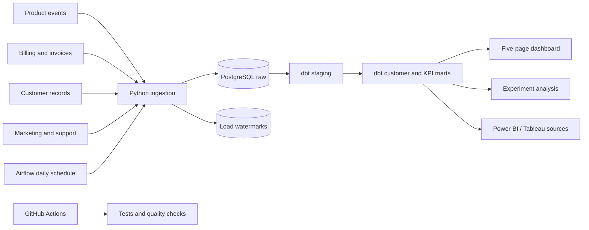

# Architecture

PulseMetrics uses one PostgreSQL database for local development. The design separates incoming records from reporting tables so each layer has a clear purpose.

## Data flow

1. **Sources:** The included generator writes repeatable CSV exports for customers, visits, subscription periods, invoices, product events, marketing spend, and support tickets. It represents a fictional company; no real customer data is bundled.
2. **Ingestion:** `pulsemetrics.ingest` reads each export, selects records newer than that source's watermark, and upserts by primary key. Data and watermark updates share a transaction. A failed load can be rerun safely.
3. **Transformations:** dbt turns raw records into a customer dimension, one customer-month revenue fact, and reporting marts. The customer-month fact is the common base for revenue movements and paid retention.
4. **Quality gates:** dbt checks keys, relationships, overlapping subscription periods, funnel order, nonnegative values, and MRR reconciliation. Freshness checks cover active customer, event, and marketing sources.
5. **Serving:** Streamlit reads the reporting marts. The experiment engine computes and stores the latest result. Power BI and Tableau can connect to the same marts.
6. **Scheduling:** Airflow runs the refresh each day at 06:00 UTC. It retries failures and can send a webhook alert. A manual Docker job runs the same pipeline.

## Storage and model boundaries

- `raw`: exact source-shaped records, with UTC timestamps and `source_updated_at`.
- `control`: one ingestion watermark and run timestamp per source.
- `analytics`: dbt dimensions, facts, marts, and stored experiment results.

The source exports live under `data/generated/` by default and are ignored by Git. In Docker, that directory is mounted into refresh and Airflow containers. The committed preview images under `assets/previews/` are a sample snapshot produced from the reporting marts.

## Local scope

PostgreSQL is the runnable warehouse. S3, Snowflake, and BigQuery are not wired into this repository, and no cloud credentials are required. Replacing the CSV exports with API or object-storage extracts only needs to preserve the source columns and update timestamp contract described in the [data dictionary](DATA_DICTIONARY.md).
